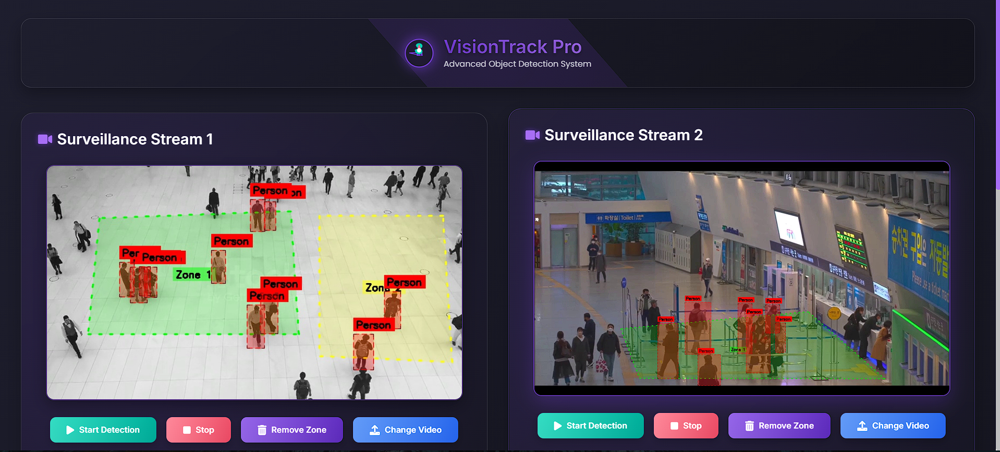

# VisionTrack Pro
- **VisionTrack Pro**  is an advanced object detection and tracking system designed to process video streams for real-time surveillance. It uses the **YOLOv8** model to detect and track objects **(Person, Car, Bus, Truck)** within user-defined **Regions of Interest (ROIs)**. The system provides a web-based dashboard to upload videos, define ROIs, start/stop detection, and visualize analytics, including object counts and class-specific data per zone, with the ability to export results as PDF reports.

-   

-   ## Project Structure
```
VisionTrackPro/
├── app.py                  # Main Flask application with video processing and SocketIO
├── templates/
│   └── index.html         # HTML dashboard for video display and controls
├── uploads/               # Directory for uploaded video files
├── static/                # (Optional) Directory for static assets 
├── requirements.txt       # Python dependencies

```

# Key Components
- **app.py**: Contains the **Flask** server, **SocketIO** for real-time communication, and the VideoProcessor class handling video processing, ROI management, and object detection/tracking.
- **index.html**: A responsive web interface for video streaming, ROI drawing, and analytics visualization.
- **uploads/**: Stores uploaded video files for processing.
- **requirements.txt**: Lists dependencies like opencv-python, **ultralytics**, **flask**, **flask-socketio**, **torch**

# How to Run
- **Prerequisites**
- Python 3.8+
- A compatible GPU (optional but recommended for faster processing)
- Install dependencies

- **1.Clone the Repository**:

```
git clone <repository-url>
cd VisionTrackPro
```
- **2.Install Dependencies**:
```
pip install -r requirements.txt
```

- Download **YOLOv8 Model**: Ensure the **yolov8m.pt** model file is available in the project directory **(downloaded automatically by Ultralytics if not present)**.
- **3.Run the Application**:
```
  python app.py
```
- The server will start at **http://0.0.0.0:5000**.
- **4.Access the Dashboard**: Open a web browser and navigate to **http://localhost:5000**.
